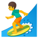

# GitHub emoji assets

This repository contains the GitHub emoji assets in PNG format, both by emoji name (under `assets/png`) or unicode (under `assets/unicode`). Here are few example:

Name | Emoji
---- | -----
+1 | 
airplane | 
alarm_clock | 
birthday | 
star | 
sunflower | 
sunrise_over_mountains | 
surfer | 
zzz | 
